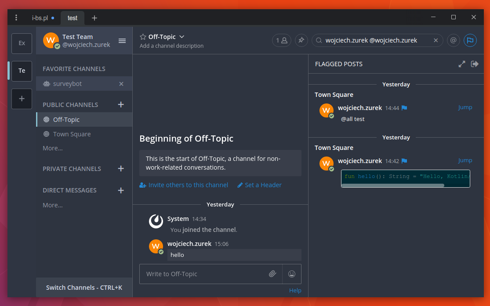

# Nord Mattermost Theme

* Open Mattermost
* Account Settings
* Display
* Custom Theme
* Paste the code

```json
{"sidebarBg":"#2e3440","sidebarText":"#d8dee9","sidebarUnreadText":"#d8dee9","sidebarTextHoverBg":"#3b4252","sidebarTextActiveBorder":"#88c0d0","sidebarTextActiveColor":"#d8dee9","sidebarHeaderBg":"#3b4252","sidebarHeaderTextColor":"#d8dee9","onlineIndicator":"#a3be8c","awayIndicator":"#ffbc42","dndIndicator":"#f74343","mentionBg":"#81a1c1","mentionBj":"#ffffff","mentionColor":"#d8dee9","centerChannelBg":"#2e3440","centerChannelColor":"#ffffff","newMessageSeparator":"#ff8800","linkColor":"#2389d7","buttonBg":"#166de0","buttonColor":"#ffffff","errorTextColor":"#fd5960","mentionHighlightBg":"#ffe577","mentionHighlightLink":"#166de0","codeTheme":"solarized-dark"}
```

* Save

# Screenshot


